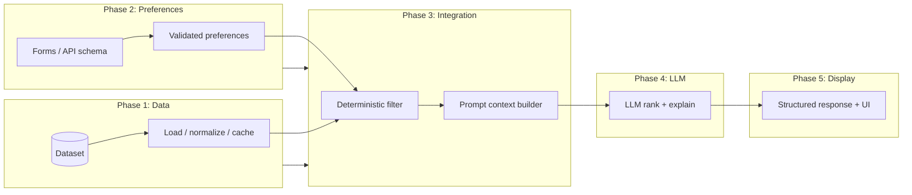
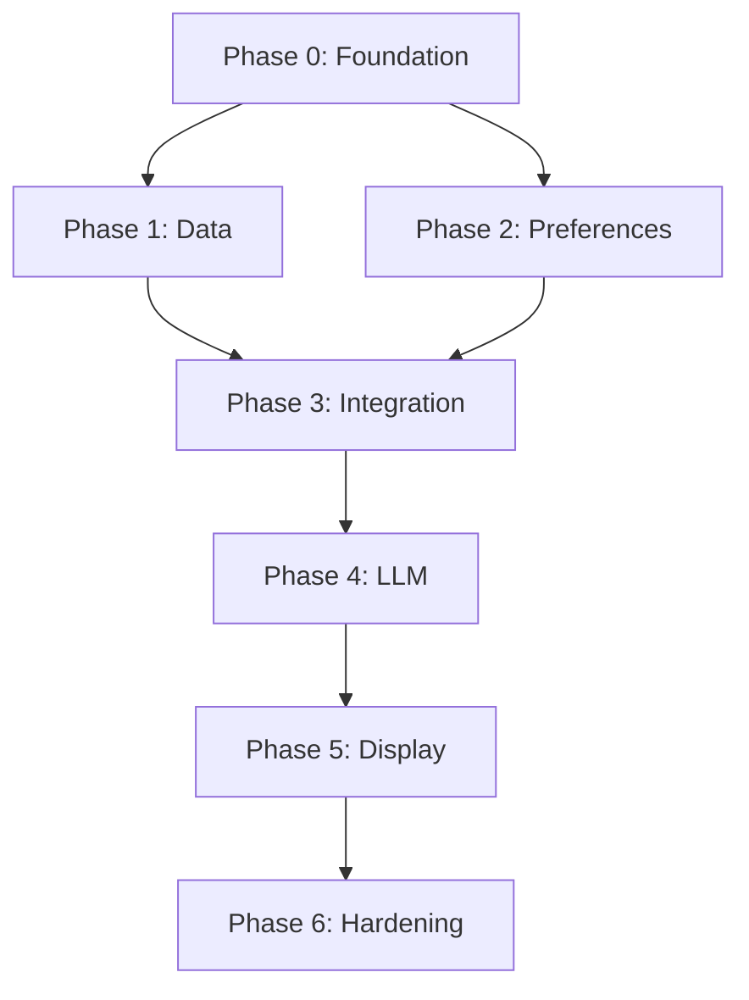

# Phase-Wise Architecture

This document decomposes the [problem statement](./problemStatement.md) into build phases. Each phase has a clear scope, outputs, and dependencies so you can implement incrementally while keeping an end-to-end path: **ingest → preferences → filter → LLM → display**.

---

## Alignment With System Workflow

| Problem statement step | Primary phase |
|------------------------|---------------|
| 1. Data ingestion | Phase 1 |
| 2. User input | Phase 2 |
| 3. Integration layer | Phase 3 |
| 4. Recommendation engine | Phase 4 |
| 5. Output display | Phase 5 |

Phases **0** and **6** cover foundation and hardening so the core pipeline is testable and deployable.

---

## End-to-End View

---

## Phase 0 — Foundation

**Goal:** Repository layout, runtime, configuration, and contracts so later phases plug in cleanly.

| Item | Description |
|------|-------------|
| **Stack** | Choose language (e.g. Python + FastAPI, or Node) and how you run the app locally. |
| **Configuration** | Environment for Hugging Face paths/cache, LLM provider base URL and API keys, feature flags. |
| **Contracts** | Define JSON schemas (or Pydantic models) for `UserPreferences`, `RestaurantRecord`, `RecommendationItem`, and `RecommendResponse` so Phases 2–5 share one source of truth. |
| **Deliverables** | Runnable skeleton app, `.env.example`, README run instructions. |

**Exit criteria:** App starts; health check endpoint (or equivalent) works without dataset or LLM.

---

## Phase 1 — Data Ingestion & Storage

**Goal:** Ground the system in [ManikaSaini/zomato-restaurant-recommendation](https://huggingface.co/datasets/ManikaSaini/zomato-restaurant-recommendation): load, normalize, and expose a queryable restaurant catalog.

| Item | Description |
|------|-------------|
| **Ingestion** | Download/load dataset (HF `datasets` or Parquet export); handle schema discovery. |
| **Normalization** | Map raw columns to `RestaurantRecord`: name, city/area, cuisines, cost band, rating, optional text fields for tags. |
| **Persistence strategy** | In-memory for MVP, or SQLite/Parquet for faster repeat queries; document refresh policy. |
| **Deliverables** | Module or service: `load_catalog()`, typed records, basic stats (row count, cities) for sanity checks. |

**Exit criteria:** You can list/filter restaurants **without** an LLM using only code and data.

**Depends on:** Phase 0.

---

## Phase 2 — User Preferences Input

**Goal:** Capture structured preferences exactly as specified in the problem statement.

| Item | Description |
|------|-------------|
| **Input surface** | CLI, REST API, or web form—consistent with Phase 0 schemas. |
| **Validation** | Location and cuisine as allowed lists or fuzzy match rules; budget enum; minimum rating bounds; optional tags. |
| **Defaults & errors** | Clear 400 responses or UI messages when constraints are impossible (e.g. no city match). |
| **Deliverables** | `POST /preferences` or equivalent + validation tests. |

**Exit criteria:** Invalid input never reaches the filter; valid payloads serialize to `UserPreferences`.

**Depends on:** Phase 0 (schemas).

---

## Phase 3 — Integration Layer (Filter + Prompt Context)

**Goal:** Deterministic candidate set and a **model-safe** context bundle—no hallucinated facts.

| Item | Description |
|------|-------------|
| **Filtering** | Hard constraints: location, budget band, cuisine (intersection or primary cuisine policy), minimum rating, optional tag rules. |
| **Candidate cap** | Top-N by rating or hybrid score before LLM to control tokens and latency. |
| **Context builder** | Serialize only allowed fields into a fixed template (table or bullets) with explicit instruction: *rank and explain using only this list*. |
| **Deliverables** | `filter_catalog(prefs) -> list[RestaurantRecord]` and `build_llm_context(candidates, prefs) -> str` (or structured messages). |

**Exit criteria:** Same preferences always yield the same candidate IDs (given fixed data version).

**Depends on:** Phases 1–2.

---

## Phase 4 — Recommendation Engine (LLM)

**Goal:** LLM ranks and explains; it does **not** invent restaurants or numeric facts.

| Item | Description |
|------|-------------|
| **Provider** | OpenAI-compatible or other SDK; retries, timeouts, token limits. |
| **Prompting** | System + user messages: output format (JSON preferred) listing `restaurant_id` or name from context, `rank`, `explanation`. |
| **Grounding guardrails** | Post-parse validation: every recommended ID/name must exist in the candidate list; drop or repair invalid rows. |
| **Deliverables** | `recommend(prefs) -> RecommendResponse` wiring filter → context → LLM → validate → map to full records. |

**Exit criteria:** Success criteria from problem statement: grounded recommendations, deterministic filter + LLM for narrative/ranking.

**Depends on:** Phase 3.

---

## Phase 5 — Output Display

**Goal:** Scannable UI or API responses: name, cuisines, rating, estimated cost, AI explanation.

| Item | Description |
|------|-------------|
| **API** | Stable response shape for clients; optional streaming for explanations later. |
| **UI** | Ranked cards or table; loading and empty states (“no restaurants match—relax rating or cuisine”). |
| **Deliverables** | Polished read path from `RecommendResponse` to human-visible layout. |

**Exit criteria:** End-to-end demo: preferences → top-k list with explanations.

**Depends on:** Phase 4.

---

## Phase 6 — Hardening & Operations (Optional but Recommended)

**Goal:** Quality, observability, and safe iteration.

| Item | Description |
|------|-------------|
| **Testing** | Unit tests for filter and validation; golden-file or snapshot tests for prompt shape (redact secrets). |
| **Observability** | Structured logs for filter counts, LLM latency, validation failures. |
| **Cost & safety** | Rate limits, max tokens, optional content filters on user free-text. |
| **Data versioning** | Pin dataset revision or export hash for reproducibility. |

**Exit criteria:** You can debug mismatches between “what user asked” and “what model returned” quickly.

**Depends on:** Phases 1–5.

---

## Phase Dependency Summary

---

## Minimal MVP Path

If time is limited, implement **0 → 1 → 2 → 3** first (filter-only recommendations with static explanations or templated text), then add **4** (LLM) and **5** (UI polish). That preserves **grounded, deterministic filtering** early while deferring model complexity.
